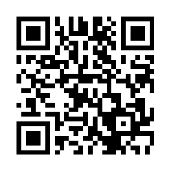

# Discord Bot Project with Ollama (llama3.2)

## Overview

This project is a feature-rich Discord bot that integrates with the Ollama API to create dynamic conversations and a variety of additional features like games, birthday reminders, and server information. The bot is designed to interact intelligently using language models, handle user-specific commands, and keep logs of interactions.

## Disclaimer

This project is a continuous work in progress. Features, functionality, and documentation may change as the development evolves. While the bot is fully operational, there may be ongoing updates, improvements, and bug fixes. Please check back regularly for the latest updates, and feel free to contribute or report issues. Your feedback and participation are highly appreciated!

# Support My Projects

If you enjoy my work and would like to support my projects, consider making a donation. Your contributions help me continue developing new projects. Every little bit helps!

<p align="center">
    <a href="https://www.paypal.com/donate/?hosted_button_id=NSFMYDYRMWMDY">
        
    </a>
    <br />
    <a href="https://www.paypal.com/donate/?hosted_button_id=NSFMYDYRMWMDY">Donate via PayPal</a>
    <br />
</p>
<br>
<p align="center">
    
    <br />
    <a href="bitcoin:bc1qwky9tu333yszy0jxep93aqnfuh3qw5uykwrk3x">Donate BTC</a>
    <br />
</p>
<br>
<p align="center">
    
    <br />
    <a href="ethereum:0xb9A5b1B571D760fb508cF0D12ccDDcCC6b232dBe">Donate ETH</a>
    <br />
</p>
<br>
<p align="center">
    
    <br />
    <a href="bitcoin:DTNdC9zrv3aHZB64ukMZZw3Nt8RQ2NoUeU">Donate DOGE</a>
    <br />
</p>
<br>
<p align="center">
    
    <br />
    <a href="ripple:rHzob7LN3usgbEYzREiNRHZUgeFvHK1dhr">Donate XRP</a>
    <br />
</p>
<br>
Thank you for your support!

## Features

- **Advanced Chat Integration**: The bot communicates using Ollama's models, enabling dynamic, context-aware conversations.
- **AURA Assistant**: Provides personalized interaction with a virtual assistant named AURA.
- **Birthday Tracking**: Automatically tracks and notifies users of upcoming birthdays.
- **Mini-Games**: Engage users with fun, interactive mini-games.
- **User & Server Information**: Provides server and user information through custom commands.
- **Command Logging**: Logs all command usages and bot interactions for auditing purposes.

## Collaboration and AI Integration

Throughout the development of this Discord bot project, I utilized the assistance of ChatGPT to brainstorm and refine key features like the AURA assistant and mini-games integration. With the help of ChatGPT's insights, I was able to enhance the bot's interaction logic and create a more user-friendly experience.

## Prerequisites

Before running the bot, you will need the following:

- A Discord Developer account and bot token (for connecting the bot to a Discord server).
- Access to the [Ollama API](https://ollama.com) for the language model capabilities.
- Python 3.8+ installed on your system.

### Python Dependencies

You can install all the required Python packages by running:

```bash
pip install -r requirements.txt
```
## Available Commands

W.I.P.

## Logging

The bot automatically logs all interactions and commands executed by users. Logs include:
- User ID
- Command name
- Timestamp
- Server and channel details

## Additional Resources

- [Ollama API Documentation](https://ollama.com)
- [Built with Llama](https://llama3.org) - Built with Llama
- [LLava](https://github.com/haotian-liu/LLaVA/tree/main) Additionally, the project leverages a powerful vision-language model, for analyzing and processing multimodal data inputs. This integration has expanded the bot's capabilities, enabling it to respond to both textual and visual prompts with context-aware interactions.

## Licenses

This project integrates third-party APIs and models which are licensed under their respective terms. You can find the licenses for these integrations here:

- [Ollama API License](https://github.com/ollama/ollama/blob/main/LICENSE)
- [Llama3.2 License](https://github.com/meta-llama/llama-models/blob/main/models/llama3_2/LICENSE)
- [LLaVA License](https://github.com/haotian-liu/LLaVA/blob/main/LICENSE)

## Contributing

Contributions are welcome! Please follow the established code style and open a pull request with your changes.

## License

This project is licensed under the MIT License. See the `LICENSE` file for details.
